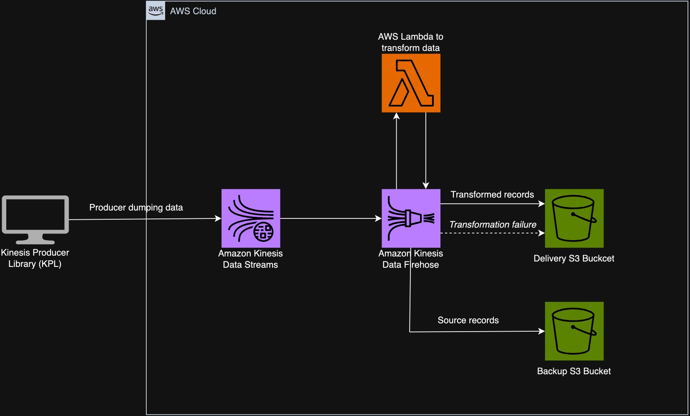
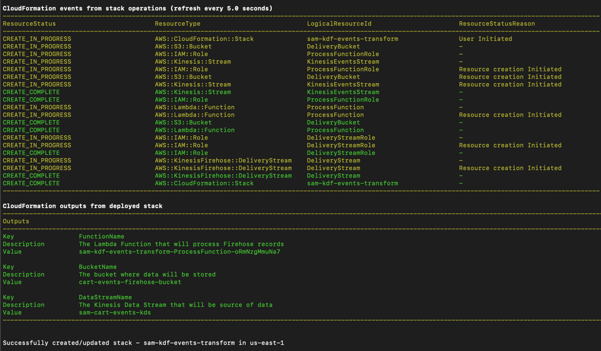

# AWS Lambda Cart Abandonment Detection Function

This project contains source code and supporting files for a serverless application that you can deploy with the SAM CLI. It includes the following files and folders.

- events_transform - Code for the application's Lambda function.
- template.yaml - A template that defines the application's AWS resources.

## Architecture Diagram

## Overview
The core purpose of this application is to intelligently process cart events, addressing cart abandonment scenarios within an e-commerce ecosystem. Cart abandonment refers to the common occurrence where a user adds items to their online shopping cart but subsequently exits the website or application without finalizing the purchase.

Here's how the application efficiently handles this process:

1. **Kinesis Data Stream**: The initial point of entry is the Kinesis Data Stream. It acts as the conduit for cart event records generated by the Kinesis Producer Library (KPL). These records encapsulate invaluable details regarding user interactions with shopping carts.

2. **Kinesis Delivery Stream** and **Lambda Function**: 
   1. **Kinesis Data Firehose**: Once the Kinesis Data Stream feeds records, they are directed to Kinesis Data Firehose. It has several key functions:
      - It receives records from the Kinesis Data Stream.
      - It buffers incoming data to a specified size, optimizing efficiency for downstream processing.
      - It asynchronously invokes a designated Lambda function, passing the buffered records.

   2. **Lambda Function**: This Lambda function plays a central role in cart abandonment detection:
       - It receives the buffered records from Kinesis Data Firehose.
      - For each event record, it calculates the time elapsed since the event occurred.
      - It cross-references this elapsed time with a predefined threshold, identifying potential cart abandonment when the threshold is exceeded.
      - The function further calculates the cumulative value of abandoned shopping carts. This is done by summing the product prices, each multiplied by its respective quantity.
      - The calculated cart abandonment information is seamlessly incorporated into the event payload for future utilization.
      - The transformed data is then sent back to Kinesis Data Firehose.
   3. **Kinesis Data Firehose** After receiving the transformed data from the Lambda function, Kinesis Data Firehose performs the following tasks:
      - It concatenates multiple transformed records into larger, optimized chunks. This is based on the configured buffering settings of the delivery stream.
      - These optimized data chunks are then efficiently delivered to an Amazon S3 bucket, where each chunk is stored as an S3 object.

In essence, this application serves as a strategic solution to enhance user experience and business insights within an e-commerce context by addressing cart abandonment scenarios intelligently and efficiently.

## Functionality
- **Cart Abandonment Detection**: The function analyzes cart events and calculates whether each cart is abandoned based on the time elapsed since the event.
- **Cart Total Calculation**: If a cart is abandoned, the function calculates the total value of the cart by summing the product prices multiplied by their quantities.
- **Event Transformation**: The function transforms the input event records, adding information about cart abandonment and cart total.
- **Logging**: The function utilizes logging to provide visibility into the processing of cart events.

## Prerequisites
Before deploying and running this project, ensure you have the following prerequisites:
- **AWS Account**: You must have an AWS account to deploy and execute Lambda functions.
- **AWS CLI**: Install and configure the AWS Command Line Interface (CLI) to manage AWS resources and configure your credentials.
- **AWS SAM CLI**: Install the AWS Serverless Application Model (SAM) CLI to package and deploy your Lambda function.
- **Python 3.9**: Ensure you have Python 3.9 installed on your local development environment.

## Deployment

To build and deploy the Python Lambda function for the first time, follow these steps:

1. Clone this repository to your local machine.

2. Navigate to the project directory containing the `template.yaml` file.

3. Build the application using the AWS SAM CLI:

```bash
sam build
```

4. Deploy the application using the AWS SAM CLI:

```bash
sam deploy --guided
```

During deployment, you'll be prompted for configuration settings:

* **Stack Name**: The name of the stack to deploy to CloudFormation. This should be unique to your account and region, and a good starting point would be something matching your project name.
* **AWS Region**: The AWS region you want to deploy your app to.
* **Confirm changes before deploy**: If set to yes, any change sets will be shown to you before execution for manual review. If set to no, the AWS SAM CLI will automatically deploy application changes.
* **Allow SAM CLI IAM role creation**: Many AWS SAM templates, including this example, create AWS IAM roles required for the AWS Lambda function(s) included to access AWS services. By default, these are scoped down to minimum required permissions. To deploy an AWS CloudFormation stack which creates or modifies IAM roles, the `CAPABILITY_IAM` value for `capabilities` must be provided. If permission isn't provided through this prompt, to deploy this example you must explicitly pass `--capabilities CAPABILITY_IAM` to the `sam deploy` command.
* **Save arguments to samconfig.toml**: If set to yes, your choices will be saved to a configuration file inside the project, so that in the future you can just re-run `sam deploy` without parameters to deploy changes to your application.
* **Stack-specific parameters** will be also available for customization: _KinesisStreamName, FirehoseBufferingInterval, FirehoseBufferingSize, FirehoseCompressionFormat, DeliveryBucketName, FirehoseS3Prefix, RawDataS3Prefix, ErrorDataS3Prefix_

## Deployment Output

After successfully deploying the resources using the `sam deploy` command, you will see output similar to the following:


Here's a breakdown of what each line represents:

- `AWS::IAM::Role`: The IAM role created for the Lambda function.
- `AWS::Kinesis::Stream`: The Amazon Kinesis stream used by the application.
- `AWS::Lambda::Function`: The AWS Lambda function itself.
- `AWS::Lambda::EventSourceMapping`: The event source mapping between the Lambda function and the Kinesis stream.
- `AWS::KinesisFirehose::DeliveryStream`: The Amazon Kinesis Delivery Stream used by the application to transform the source data using AWS Lambda and deliver the transformed data to the s3 delivery bucket.
- `AWS::CloudFormation::Stack`: The AWS CloudFormation stack that includes all the deployed resources.

This output confirms that the deployment was successful, and all the necessary resources have been created in your AWS environment.

## Usage
The AWS Lambda function will automatically process incoming cart events. It will calculate if each cart is abandoned and, if so, calculate the cart's total value. The results will be added to the event payload, and the transformed records will be available for further processing.

## Monitoring
You can monitor the AWS Lambda function's execution, view logs, and set up alerts using AWS CloudWatch.

## Error Handling
The Lambda function includes basic error handling to log errors when processing cart events. You can extend error handling and logging as needed to suit your specific use case.

## Cleanup
To delete the sample application, use the AWS CLI. Assuming you used your project name for the stack name, you can run the following:

```bash
sam delete --stack-name sam-kdf-events-transform
```

### Cleanup Troubleshooting
In case your s3 bucket is non-empty the following error might occur during stack deletion:

```bash
Stack:arn:aws:cloudformation:us-east-1::stack/sam-kdf-events-transform/xxx is in DELETE_FAILED state and can not be updated.
```
To fix it delete the s3 bucket manually and re-try.